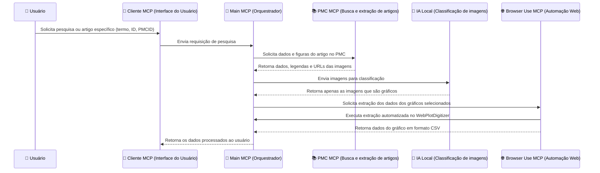

Perfeito, Davi 👍 — com essas correções, aqui está o **resumo completo e atualizado** do projeto **Nefarm AI**, refletindo o escopo atual, papéis dos componentes e a forma como a comunicação acontece:

---

# 🧠 Nefarm AI — Arquitetura e Resumo Técnico

## 📘 Visão Geral

O **Nefarm AI** é um sistema orientado a serviços voltado para a **extração e análise automatizada de gráficos** contidos em artigos científicos da base **PubMed Central (PMC)**.

O projeto utiliza o **Model Context Protocol (MCP)** para permitir a comunicação modular entre agentes especializados — chamados de *MCPs* —, cada um responsável por uma etapa específica do fluxo de processamento.

A arquitetura é **orientada a serviços (SOA)**, permitindo desacoplamento entre módulos, escalabilidade e substituição independente de cada componente.

---

## ⚙️ Componentes Principais

### 1. 🧩 **Nefarm MCP (MCP Central / Main MCP)**

* Atua como **orquestrador** de toda a pipeline.
* Recebe o pedido do usuário e coordena a comunicação entre os demais MCPs.
* Controla o fluxo: entrada do artigo → extração de imagens → classificação → extração dos dados dos gráficos.
* Pode ser entendido como o **agente principal** do sistema.

### 2. 📄 **PMC Extractor MCP**

* Responsável por **buscar e extrair o conteúdo HTML** de artigos hospedados no **PubMed Central (PMC)**.
* Localiza **links diretos das imagens** (armazenadas no CDN `https://cdn.ncbi.nlm.nih.gov/pmc/blobs/`).
* Retorna para o Nefarm MCP apenas os URLs das imagens encontradas.

### 3. 🧠 **IA Local MCP**

* Implementa uma **IA leve** executada localmente.
* Sua função é **analisar a legenda de cada imagem** e determinar **se ela representa um gráfico ou não**.
* Pode usar modelos compactos como **DistilBERT**, **MiniLM**, ou um **classificador local treinado com dados textuais curtos**.
* O modelo não precisa de reentreinamento frequente — apenas uma inferência rápida baseada no texto da legenda.

### 4. 🌐 **Browse Use MCP**

* Responsável por **abrir os links das imagens identificadas como gráficos**.
* Pode integrar com ferramentas de extração automatizada, como scripts headless ou bibliotecas que coletam **dados dos gráficos em formato CSV, JSON ou estruturado**.
* Retorna ao Nefarm MCP os dados estruturados obtidos.

---

## 🔄 Fluxo de Comunicação

---

## 🧩 Justificativa da Arquitetura

A escolha por uma **arquitetura orientada a serviços (SOA)** se deve à natureza **modular e distribuída dos MCPs**:

* Cada componente é um **serviço independente**, responsável por uma parte bem definida do processo.
* Facilita **integração, reuso e substituição** de módulos (por exemplo, trocar a IA local sem alterar o restante do sistema).
* Alinha-se com o **padrão do Model Context Protocol**, que já incentiva comunicações desacopladas entre serviços.

---

## 🛠️ Próximos Itens a Definir

| Item                           | Descrição                                                                                |
| ------------------------------ | ---------------------------------------------------------------------------------------- |
| 🧠 Modelo IA Local             | Escolher modelo leve (ex: DistilBERT ou MiniLM) para classificação de legendas           |
| 📦 Estrutura dos endpoints MCP | Nome, descrição e formato dos comandos de cada MCP                                       |
| 🔐 Políticas de segurança      | Aplicar recomendações do MCP (como isolamento de credenciais e autenticação de chamadas) |
| 🧱 ADRs                        | Criar documentos de decisão para justificar as tecnologias e abordagens escolhidas       |
| 🧩 Orquestração                | Definir se o Nefarm MCP usará prompts ou scripts de fluxo fixo                           |

---

Quer que eu adicione ao final do README uma seção “📄 Documentação Técnica (Resumo para GitHub)” com esse texto formatado em Markdown, pronto para ser copiado para o repositório?
