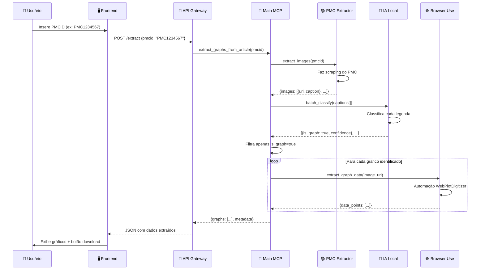
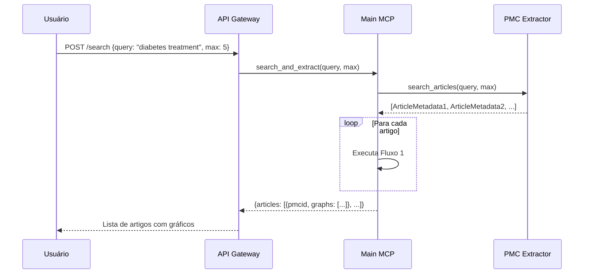

# 🏗️ Arquitetura Técnica Detalhada - Nefarm AI

## 📋 Índice

1. [Visão Geral](#visão-geral)
2. [Mapeamento com Requisitos Acadêmicos](#mapeamento-com-requisitos-acadêmicos)
3. [Componentes do Sistema](#componentes-do-sistema)
4. [Stack Tecnológico](#stack-tecnológico)
5. [Contratos MCP e Endpoints](#contratos-mcp-e-endpoints)
6. [Containerização](#containerização)
7. [Fluxos de Dados Detalhados](#fluxos-de-dados-detalhados)
8. [Considerações de Segurança](#considerações-de-segurança)
9. [Roadmap de Implementação](#roadmap-de-implementação)

---

## 🎯 Visão Geral

O **Nefarm AI** é um sistema distribuído baseado em microserviços que utiliza múltiplos agentes de IA especializados para automatizar a extração e análise de gráficos científicos do PubMed Central (PMC).

### Problema a Resolver

**Dor identificada:** Pesquisadores perdem tempo significativo extraindo manualmente dados de gráficos em artigos científicos para realizar meta-análises ou estudos comparativos.

**Solução proposta:** Sistema automatizado que:
- Busca artigos científicos no PMC
- Identifica automaticamente quais imagens são gráficos (via IA)
- Extrai dados estruturados dos gráficos via automação web
- Retorna dados prontos para análise (CSV/JSON)

---

## 🎓 Mapeamento com Requisitos Acadêmicos

| Requisito | Implementação no Nefarm AI | Pontuação |
|-----------|----------------------------|-----------|
| **Agentes de IA** | | |
| ├─ Mínimo 2 agentes | ✅ 4 MCPs (Main, PMC Extractor, IA Local, Browser Use) | 3 pts |
| └─ 1 agente local containerizado | ✅ **IA Local MCP** em Docker | 7 pts |
| **Comunicação** | | |
| ├─ MCP entre IAs | ✅ Model Context Protocol (stdio/SSE) | +4 pts |
| ├─ Microserviços | ✅ Cada MCP é um microserviço independente | 3 pts |
| └─ API | ✅ API REST/WebSocket para frontend | 3 pts |
| **Controle de Versão** | ✅ GitHub (repositório: neefarm-extract) | ✓ |
| **Documentação Arquitetônica** | | |
| ├─ Pré-modelagem | ✅ Documento em `docs/1. pre-modelagem-de-ameaca/` | 5 pts |
| ├─ Modelagem de ameaças | ⏳ A fazer (próxima etapa) | 5 pts |
| └─ Pós-modelagem | ⏳ A fazer (após implementação) | 5 pts |
| **Validação do Problema** | | |
| ├─ Relevância | 📝 Seção de referências no README | 2,5 pts |
| └─ Documentação da dor | 📝 Caso de uso documentado | 1,5 pts |

**Total esperado:** 35 pts + 4 pts extras = **39 pts**

---

## 🧩 Componentes do Sistema

### 1. 🧠 **Main MCP (Nefarm Orchestrator)**

**Tipo:** Agente orquestrador
**Responsabilidade:** Coordenar comunicação entre MCPs e gerenciar o fluxo de trabalho
**Tecnologia:** Python 3.11+ com MCP SDK
**Containerizado:** Não (pode ser containerizado opcionalmente)

**Funções principais:**
- Receber requisições do cliente (via API)
- Orquestrar chamadas sequenciais aos MCPs especializados
- Agregar resultados e retornar ao cliente
- Tratamento de erros e retry logic

**Endpoints MCP expostos:**
- `extract_graphs_from_article(pmcid: str) → GraphData[]`
- `search_and_extract(query: str, max_articles: int) → ArticleGraphs[]`

---

### 2. 📚 **PMC Extractor MCP**

**Tipo:** Microserviço de extração de dados
**Responsabilidade:** Buscar e extrair conteúdo de artigos do PubMed Central
**Tecnologia:** Python + BeautifulSoup4 / lxml
**Containerizado:** Não (stateless, leve)

**Funções principais:**
- Buscar artigos por PMCID ou termo de pesquisa
- Extrair HTML do artigo
- Localizar URLs de imagens no CDN da NCBI
- Extrair legendas (captions) das figuras
- Retornar metadados + lista de imagens

**Endpoints MCP expostos:**
- `fetch_article(pmcid: str) → ArticleMetadata`
- `extract_images(pmcid: str) → ImageData[]`
- `search_articles(query: str, max_results: int) → ArticleMetadata[]`

**Estrutura de dados retornados:**
```json
{
  "pmcid": "PMC1234567",
  "title": "Study on...",
  "authors": ["Author 1", "Author 2"],
  "images": [
    {
      "url": "https://cdn.ncbi.nlm.nih.gov/pmc/blobs/...",
      "caption": "Figure 1. Growth curve showing...",
      "figure_id": "fig1"
    }
  ]
}
```

---

### 3. 🤖 **IA Local MCP (Graph Classifier)**

**Tipo:** Agente de IA local containerizado
**Responsabilidade:** Classificar se uma imagem é gráfico baseado na legenda
**Tecnologia:** Python + Transformers (HuggingFace) + Docker
**Containerizado:** ✅ **SIM (requisito obrigatório)**

**Modelo proposto:**
- **DistilBERT** fine-tuned para classificação de texto científico
- Alternativa: **MiniLM-L6** (ainda mais leve)
- Input: Texto da legenda (caption)
- Output: `{"is_graph": true/false, "confidence": 0.95}`

**Por que apenas legenda?**
- Análise de imagem seria muito pesada para rodar localmente
- Legendas científicas são altamente descritivas
- Precisão aceitável com modelo NLP leve

**Endpoints MCP expostos:**
- `classify_caption(caption: str) → ClassificationResult`
- `batch_classify(captions: str[]) → ClassificationResult[]`

**Container Docker:**
- Base image: `python:3.11-slim`
- Modelo pré-carregado no build
- Comunicação via MCP stdio ou SSE
- Health check endpoint

---

### 4. 🌐 **browser-use MCP**

**Tipo:** Microserviço de automação web guiada por IA
**Responsabilidade:** Extrair dados de gráficos usando ferramentas online (WebPlotDigitizer)
**Tecnologia:** browser-use (MCP nativo) + LLM para navegação inteligente
**Containerizado:** Opcional (pode usar imagem Playwright)
**Requer:** API key de LLM (Anthropic, OpenAI, Google ou browser-use credits)

**⚠️ IMPORTANTE:** Este MCP já existe pronto - não precisa implementar do zero!
- Instalação: `pip install browser-use && uvx browser-use install`
- Execução: `uvx browser-use --mcp`
- Comunicação: **stdio** (FastAPI spawna processo)

**Ferramenta alvo (inicial):**
- **WebPlotDigitizer** (https://web.eecs.utk.edu/~dcostine/personal/PowerDeviceLib/DigiTest/index.html)
- Suporte confirmado pela documentação browser-use

**Fluxo de automação (IA-guided):**
1. FastAPI spawna browser-use MCP via stdio
2. Envia task para o LLM: "Extract data from chart using WebPlotDigitizer"
3. LLM **decide autonomamente** os steps:
   - Abrir WebPlotDigitizer
   - Upload da imagem
   - Navegar pela interface
   - Extrair dados
4. Retorna dados estruturados

**Vantagens sobre Playwright puro:**
- ✅ Robustez contra mudanças de layout (LLM adapta)
- ✅ Menos código (não precisa scripts fixos)
- ✅ MCP server pronto (não precisa implementar)

**Desvantagens:**
- ⚠️ Requer API key adicional (custo)
- ⚠️ Latência maior (~30-60s por gráfico)
- ⚠️ Não determinístico (LLM pode variar)

**Endpoints MCP expostos (pelo browser-use):**
- `navigate_and_extract(task: str, url: str) → ExtractedData`
- Outros tools disponíveis na documentação browser-use

**Estrutura de dados retornados:**
```json
{
  "image_url": "https://...",
  "data_points": [
    {"x": 0.5, "y": 1.2},
    {"x": 1.0, "y": 2.4}
  ],
  "metadata": {
    "x_label": "Time (hours)",
    "y_label": "Concentration (mg/L)",
    "extraction_method": "webplotdigitizer",
    "extracted_via": "browser-use"
  },
  "llm_steps_taken": 12,  # Quantos passos o LLM tomou
  "extraction_time_seconds": 45
}
```

**Configuração necessária:**
```bash
# .env
# Escolher uma opção:
BROWSER_USE_API_KEY=buse_xxx  # $10 grátis (recomendado para MVP)
# ou
ANTHROPIC_API_KEY=sk-ant-xxx
# ou
OPENAI_API_KEY=sk-xxx
# ou
GOOGLE_API_KEY=AIza-xxx
```

**Integração com FastAPI:**
```python
# Exemplo de uso
from mcp.client.stdio import stdio_client

async def extract_chart(image_url: str):
    server_params = StdioServerParameters(
        command="uvx",
        args=["browser-use", "--mcp"],
        env={"ANTHROPIC_API_KEY": os.getenv("ANTHROPIC_API_KEY")}
    )
    async with stdio_client(server_params) as (read, write):
        async with ClientSession(read, write) as session:
            result = await session.call_tool("navigate_and_extract", {
                "task": f"Extract data from chart at {image_url} using WebPlotDigitizer"
            })
            return result
```

---

## 💻 Stack Tecnológico

### Backend (MCPs)

| Componente | Tecnologia | Justificativa |
|------------|------------|---------------|
| **Linguagem** | Python 3.11+ | SDK MCP oficial, ricas bibliotecas científicas |
| **MCP SDK** | `modelcontextprotocol` (PyPI) | Protocolo oficial para comunicação entre agentes |
| **Web Scraping** | BeautifulSoup4 + requests | Extração de HTML do PMC |
| **IA/NLP** | Transformers (HuggingFace) | Modelos pré-treinados leves para classificação |
| **Automação Web** | **browser-use** (MCP nativo) | IA-guided browser automation, robusto a mudanças de layout |
| **LLMs** | Anthropic Claude / OpenAI GPT / Google Gemini | Orquestração (Main MCP) + Navegação (browser-use) |
| **Containerização** | Docker + Docker Compose | Isolamento do modelo IA, facilita deploy |

### API Gateway (Comunicação Frontend ↔ Backend)

| Componente | Tecnologia | Justificativa |
|------------|------------|---------------|
| **Framework** | FastAPI | Async, auto-documentação (OpenAPI), WebSocket support |
| **Protocolo** | REST + WebSocket | REST para comandos, WS para streaming de progresso |
| **Validação** | Pydantic | Type-safe, integração nativa com FastAPI |

### Frontend (A decidir)

Opções sugeridas:
- **React + TypeScript** (mais popular, ecossistema maduro)
- **Vue 3 + TypeScript** (mais simples, curva de aprendizado menor)
- **Svelte** (performance, código mais limpo)

**Requisitos do frontend:**
- Formulário de pesquisa (PMCID ou termo)
- Visualização de progresso do processamento
- Exibição de gráficos identificados
- Download de dados extraídos (CSV/JSON)

### Infraestrutura

| Componente | Tecnologia |
|------------|------------|
| **Orquestração** | Docker Compose (dev) / Kubernetes (prod) |
| **CI/CD** | GitHub Actions |
| **Versionamento** | Git + GitHub |

---

## 💰 Custos e API Keys

### Necessidade de Múltiplas API Keys

O sistema requer **2 LLMs funcionando simultaneamente**:

| Componente | LLM Necessário | Função | API Key |
|------------|---------------|--------|---------|
| **Main MCP** | Sim | Orquestração entre MCPs | `ANTHROPIC_API_KEY` (ou similar) |
| **browser-use MCP** | Sim | Navegação web inteligente | `ANTHROPIC_API_KEY` (ou similar) |
| **IA Local MCP** | Não | Classificação (modelo local) | ❌ Não requer |
| **PMC Extractor** | Não | Scraping (sem IA) | ❌ Não requer |

**⚠️ IMPORTANTE:** Cada MCP precisa de sua própria API key configurada. **Não compartilham keys.**

### Estimativa de Custos (MVP)

**Usando browser-use credits ($10 grátis):**
- Main MCP: Pode usar Claude via Anthropic API (teste gratuito ou pago)
- browser-use MCP: Usa `BROWSER_USE_API_KEY` ($10 grátis)

**Cenário de teste (100 gráficos):**

| Operação | LLM Calls | Custo Estimado |
|----------|-----------|----------------|
| Orquestração (Main MCP) | ~10 calls/gráfico | ~$0.005-0.01/gráfico |
| Navegação (browser-use) | ~30-50 calls/gráfico | ~$0.01-0.02/gráfico |
| **Total por gráfico** | ~40-60 calls | **~$0.015-0.03** |
| **100 gráficos** | ~4000-6000 calls | **~$1.50-3.00** |

**Mitigações de custo:**
1. ✅ Usar `BROWSER_USE_API_KEY` ($10 grátis) para MVP
2. ✅ Usar **Gemini** (Google) - Mais barato que Claude/GPT
3. ✅ Cache de resultados (não reprocessar mesmo artigo)
4. ✅ Batch processing (processar múltiplos gráficos em paralelo)

### Opções de LLM por Custo

| Provedor | Modelo | Custo (input/output) | Recomendação |
|----------|--------|----------------------|--------------|
| **browser-use** | Credits próprios | $10 grátis | ✅ **MVP** |
| **Google** | Gemini 1.5 Flash | $0.075 / $0.30 por 1M tokens | ✅ Produção (barato) |
| **Anthropic** | Claude Sonnet 4 | $3 / $15 por 1M tokens | ⚠️ Mais caro, melhor qualidade |
| **OpenAI** | GPT-4o-mini | $0.15 / $0.60 por 1M tokens | ✅ Alternativa boa |

**Recomendação inicial:**
```bash
# .env para MVP
BROWSER_USE_API_KEY=buse_xxx        # $10 grátis
GOOGLE_API_KEY=AIza_xxx             # Para Main MCP (gratuito em certos limites)
```

### Plano de Otimização de Custos

**Fase 1 (MVP - Grátis):**
- browser-use: $10 credits grátis
- Main MCP: Gemini free tier
- **Custo:** $0 (até acabar créditos)

**Fase 2 (Produção):**
- browser-use: Migrar para Gemini
- Main MCP: Gemini
- Cache de resultados
- **Custo:** ~$0.01-0.02 por gráfico

**Fase 3 (Otimização):**
- Considerar implementar Playwright puro para casos simples
- Usar browser-use apenas para gráficos complexos
- **Custo:** ~$0.005-0.01 por gráfico

---

## 🔌 Contratos MCP e Endpoints

### Protocolo MCP

O Model Context Protocol define comunicação entre cliente e servidor via **JSON-RPC 2.0**.

**Transporte:**
- **stdio** (padrão para MCPs locais)
- **Server-Sent Events (SSE)** via HTTP (para MCPs remotos)

### Especificação dos Endpoints

#### **Main MCP (Orchestrator)**

```typescript
// Tool: extract_graphs_from_article
{
  "name": "extract_graphs_from_article",
  "description": "Extract graph data from a PMC article by PMCID",
  "inputSchema": {
    "type": "object",
    "properties": {
      "pmcid": {
        "type": "string",
        "description": "PubMed Central ID (e.g., PMC1234567)"
      }
    },
    "required": ["pmcid"]
  }
}

// Response:
{
  "pmcid": "PMC1234567",
  "article_title": "...",
  "graphs_found": 3,
  "graphs": [
    {
      "figure_id": "fig1",
      "caption": "...",
      "image_url": "...",
      "extracted_data": {
        "data_points": [...],
        "metadata": {...}
      }
    }
  ]
}
```

#### **PMC Extractor MCP**

```typescript
// Tool: extract_images
{
  "name": "extract_images",
  "description": "Extract images and captions from PMC article",
  "inputSchema": {
    "type": "object",
    "properties": {
      "pmcid": {"type": "string"}
    },
    "required": ["pmcid"]
  }
}
```

#### **IA Local MCP**

```typescript
// Tool: classify_caption
{
  "name": "classify_caption",
  "description": "Classify if a caption describes a graph/chart",
  "inputSchema": {
    "type": "object",
    "properties": {
      "caption": {
        "type": "string",
        "description": "Figure caption text"
      }
    },
    "required": ["caption"]
  }
}

// Response:
{
  "is_graph": true,
  "confidence": 0.92,
  "graph_type": "line_chart" // opcional
}
```

#### **Browser Use MCP**

```typescript
// Tool: extract_graph_data
{
  "name": "extract_graph_data",
  "description": "Extract data points from graph image using web tools",
  "inputSchema": {
    "type": "object",
    "properties": {
      "image_url": {"type": "string"},
      "graph_type": {"type": "string", "enum": ["scatter", "line", "bar"]}
    },
    "required": ["image_url"]
  }
}
```

---

## 🐳 Containerização

### Estratégia de Containers

**Containers obrigatórios:**
1. ✅ **IA Local MCP** (requisito acadêmico)

**Containers opcionais (recomendados):**
2. Browser Use MCP (isolar Chromium)
3. API Gateway (FastAPI)
4. Frontend (Nginx + build estático)

### Dockerfile - IA Local MCP

```dockerfile
# docs/2. arquitetura-tecnica/dockerfiles/ia-local-mcp.Dockerfile

FROM python:3.11-slim

WORKDIR /app

# Instalar dependências do sistema
RUN apt-get update && apt-get install -y \
    build-essential \
    && rm -rf /var/lib/apt/lists/*

# Copiar requirements
COPY requirements.txt .
RUN pip install --no-cache-dir -r requirements.txt

# Baixar modelo no build (evita download em runtime)
RUN python -c "from transformers import AutoModelForSequenceClassification, AutoTokenizer; \
    model_name='distilbert-base-uncased'; \
    AutoModelForSequenceClassification.from_pretrained(model_name); \
    AutoTokenizer.from_pretrained(model_name)"

# Copiar código do MCP
COPY src/ia_local_mcp/ ./ia_local_mcp/

# Expor porta para MCP SSE (se usar HTTP)
EXPOSE 8000

# Health check
HEALTHCHECK --interval=30s --timeout=3s \
    CMD python -c "import requests; requests.get('http://localhost:8000/health')"

# Comando de inicialização
CMD ["python", "-m", "ia_local_mcp.server"]
```

### Docker Compose (Ambiente de Desenvolvimento)

```yaml
# docker-compose.yml

version: '3.8'

services:
  ia-local-mcp:
    build:
      context: .
      dockerfile: dockerfiles/ia-local-mcp.Dockerfile
    container_name: nefarm-ia-local
    ports:
      - "8001:8000"
    environment:
      - MODEL_NAME=distilbert-base-uncased
      - MCP_TRANSPORT=sse
    volumes:
      - ./models:/app/models  # Cache de modelos
    restart: unless-stopped
    networks:
      - nefarm-network

  api-gateway:
    build:
      context: .
      dockerfile: dockerfiles/api-gateway.Dockerfile
    container_name: nefarm-api
    ports:
      - "8000:8000"
    environment:
      - IA_LOCAL_MCP_URL=http://ia-local-mcp:8000
    depends_on:
      - ia-local-mcp
    networks:
      - nefarm-network

networks:
  nefarm-network:
    driver: bridge
```

---

## 🔄 Fluxos de Dados Detalhados

### Fluxo 1: Extração por PMCID



### Fluxo 2: Busca por Termo



### Fluxo 3: Comunicação MCP (Detalhes Técnicos)

**Exemplo de chamada JSON-RPC 2.0:**

```json
// Cliente → Servidor MCP
{
  "jsonrpc": "2.0",
  "id": 1,
  "method": "tools/call",
  "params": {
    "name": "classify_caption",
    "arguments": {
      "caption": "Figure 1. Growth curve showing bacterial density over time."
    }
  }
}

// Servidor MCP → Cliente
{
  "jsonrpc": "2.0",
  "id": 1,
  "result": {
    "is_graph": true,
    "confidence": 0.94,
    "graph_type": "line_chart"
  }
}
```

---

## 🔒 Considerações de Segurança

> **Nota:** Esta seção apresenta considerações iniciais. A **Modelagem de Ameaças** completa será feita na próxima etapa.

### Princípios de Segurança MCP (Best Practices)

Baseado em: https://modelcontextprotocol.io/specification/draft/basic/security_best_practices

#### 1. **Isolamento de Credenciais**
- ❌ Não armazenar API keys hardcoded
- ✅ Usar variáveis de ambiente
- ✅ Secrets em Docker via `.env` files (não commitados)

#### 2. **Validação de Entrada**
- ✅ Validar PMCID (formato: `PMC\d+`)
- ✅ Sanitizar queries de busca (prevenir injeção)
- ✅ Validar URLs de imagens (whitelist de domínios: `ncbi.nlm.nih.gov`)

#### 3. **Rate Limiting**
- ✅ Limitar requisições ao PMC (evitar banimento)
- ✅ Throttling na API Gateway (ex: 10 req/min por IP)

#### 4. **Sandboxing**
- ✅ Browser Use MCP em container isolado
- ✅ Sem acesso a filesystem do host
- ✅ Rede isolada (Docker networks)

#### 5. **Autenticação entre MCPs**
- 🔄 Opcional para MVP
- ✅ Recomendado: JWT tokens entre serviços
- ✅ mTLS para comunicação sensível

#### 6. **Logs e Auditoria**
- ✅ Logging estruturado (JSON)
- ✅ Rastreamento de requisições (correlation ID)
- ❌ Não logar dados sensíveis

### Riscos Identificados (Prévia)

| Risco | Severidade | Mitigação Planejada |
|-------|------------|---------------------|
| Injeção de código via PMCID malicioso | Média | Validação rigorosa com regex |
| Scraping bloqueado pelo PMC | Alta | Rate limiting + User-Agent adequado |
| SSRF via URL de imagem maliciosa | Alta | Whitelist de domínios |
| Modelo IA retorna falso positivo | Baixa | Threshold de confiança configurável |
| Container comprometido acessa host | Média | Namespaces, capabilities drop, read-only FS |

---

## 🗺️ Roadmap de Implementação

### Fase 1: Setup e Infraestrutura (Semana 1)
- [ ] Estrutura de pastas do projeto
- [ ] Setup do ambiente Python (venv, requirements.txt)
- [ ] Configuração Docker Compose
- [ ] CI/CD básico (GitHub Actions)

### Fase 2: MCP Base (Semana 2)
- [ ] Implementar PMC Extractor MCP
  - [ ] Scraping básico do PMC
  - [ ] Extração de imagens e legendas
  - [ ] Testes unitários
- [ ] Implementar IA Local MCP
  - [ ] Integração com modelo DistilBERT
  - [ ] Dockerfile e containerização
  - [ ] Testes de classificação

### Fase 3: Automação e Orquestração (Semana 3)
- [ ] Implementar Browser Use MCP
  - [ ] Integração com Playwright
  - [ ] Automação WebPlotDigitizer
  - [ ] Tratamento de erros
- [ ] Implementar Main MCP (Orchestrator)
  - [ ] Lógica de orquestração
  - [ ] Comunicação entre MCPs
  - [ ] Error handling e retries

### Fase 4: API e Frontend (Semana 4)
- [ ] API Gateway (FastAPI)
  - [ ] Endpoints REST
  - [ ] WebSocket para progresso
  - [ ] Documentação OpenAPI
- [ ] Frontend básico
  - [ ] Interface de busca
  - [ ] Visualização de resultados
  - [ ] Download de dados

### Fase 5: Testes e Documentação (Semana 5)
- [ ] Testes de integração end-to-end
- [ ] Modelagem de Ameaças (STRIDE/DREAD)
- [ ] Implementação de medidas de segurança
- [ ] Arquitetura pós-modelagem
- [ ] README completo com referências

---

## 📚 Referências Técnicas

- [Model Context Protocol - Specification](https://modelcontextprotocol.io/)
- [MCP Python SDK](https://github.com/modelcontextprotocol/python-sdk)
- [MCP Security Best Practices](https://modelcontextprotocol.io/specification/draft/basic/security_best_practices)
- [PubMed Central API](https://www.ncbi.nlm.nih.gov/pmc/tools/developers/)
- [WebPlotDigitizer](https://automeris.io/WebPlotDigitizer/)
- [Playwright Python](https://playwright.dev/python/)
- [HuggingFace Transformers](https://huggingface.co/docs/transformers/index)

---

## 📝 Próximos Passos

1. **Validação desta arquitetura** → Revisar e aprovar
2. **Modelagem de Ameaças** → Aplicar STRIDE/DREAD
3. **Implementação incremental** → Seguir roadmap acima
4. **Testes contínuos** → CI/CD desde o início
5. **Documentação paralela** → ADRs para decisões arquiteturais

---

**Documento criado em:** 2025-11-05
**Versão:** 1.0
**Status:** 🟡 Aguardando aprovação
