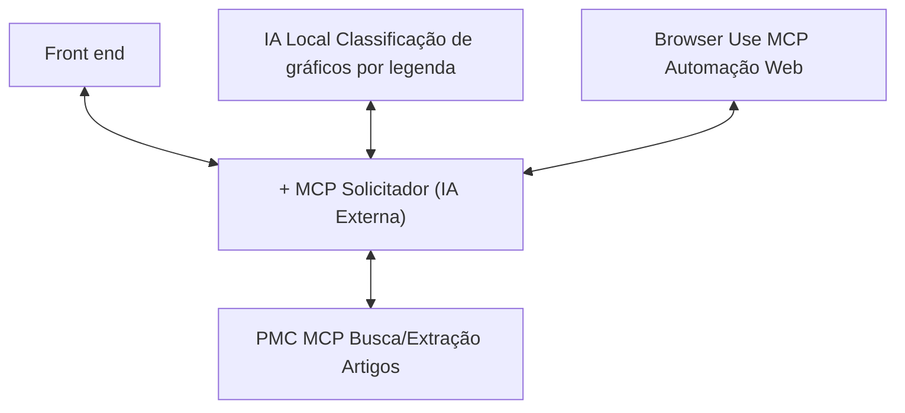

# 1. Visão Arquitetônica Inicial — Sistema NEFARM-AI

## 1.1. Introdução

O **nefarm-ai** é um sistema voltado à extração e análise automatizada de informações visuais presentes em artigos científicos, com foco em identificar e extrair dados de gráficos publicados em artigos científicos.

Seu objetivo é agilizar o processo de coleta e organização de dados científicos por meio da integração entre um agente inteligente (MCP) e um modelo local de inteligência artificial.

O sistema segue uma **arquitetura orientada a serviços** (SOA), composta por módulos independentes que se comunicam de forma orquestrada, favorecendo escalabilidade, isolamento e facilidade de manutenção.

---

## 1.2. Visão Arquitetônica Inicial (Pré-modelagem de Ameaças)

### 1.2.1. Estrutura Geral

Na versão inicial do sistema, o **Frontend** se comunica **diretamente** com o **MCP Solicitador** (IA Externa), responsável por coordenar os demais agentes MCP.

Cada **MCP** executa uma função específica e independente, sendo acionado conforme a natureza da tarefa.

### 1.2.2. Componentes Principais

| Componente                | Descrição                                                                 | Tecnologia                  |
|---------------------------|---------------------------------------------------------------------------|-----------------------------|
| **Frontend**               | Interface de interação com o usuário, responsável por enviar solicitações e exibir resultados. | React                      |
| **MCP Solicitador (IA Externa)** | Atua como orquestrador central, recebendo as requisições do frontend e distribuindo as tarefas aos MCPs especializados. | Python/IA Externa |
| **PMC MCP**                | Executa buscas e extração de artigos científicos em repositórios externos (ex.: PubMed Central). | Python                     |
| **IA Local**               | Modelo de visão computacional baseado em **MobileNetV2**, utilizado para classificar e identificar tipos de gráficos científicos por legenda. | Python |
| **Browser Use MCP**        | Realiza automações web e coleta de dados complementares em páginas externas. | Python |
| **Ambiente Docker**        | Contêineriza todos os serviços, facilitando a execução local e a comunicação entre módulos. | Docker Compose              |

### 1.2.3. Diagrama de Arquitetura Inicial

---

## 1.3. Fluxo de Dados

### 1.3.1. Fluxo Principal de Operação

1. **Usuário** acessa o **Frontend** e solicita extração de gráficos de artigos científicos
2. **Frontend** envia requisição HTTP diretamente ao **MCP Solicitador**
3. **MCP Solicitador** analisa a requisição e distribui tarefas:
   - Envia solicitação ao **PMC MCP** para buscar artigos no PubMed Central
   - Aciona **Browser Use MCP** para automação web complementar
   - Comunica-se com **IA Local** para classificação de gráficos
4. Cada **MCP** processa sua tarefa e retorna resultados ao **MCP Solicitador**
5. **MCP Solicitador** consolida as respostas
6. **Frontend** recebe e exibe os resultados ao usuário

### 1.3.2. Elementos do Sistema (DFD)

Para a modelagem de ameaças, identificamos os seguintes elementos:

- **Entidades Externas:**
  - Usuário
  - Repositórios externos (PubMed Central)
  - Websites para automação

- **Processos:**
  - Frontend (React)
  - MCP Solicitador (Orquestrador)
  - PMC MCP (Extração de artigos)
  - IA Local (Classificação de gráficos)
  - Browser Use MCP (Automação web)

- **Fluxos de Dados:**
  - Frontend ↔ MCP Solicitador
  - MCP Solicitador ↔ MCPs especializados
  - MCPs ↔ Repositórios externos

---

## 1.4. Limites de Confiança

Os **limites de confiança** representam fronteiras onde o controle de segurança muda. Na arquitetura inicial, identificamos:

| Limite | Descrição | Nível de Confiança |
|--------|-----------|-------------------|
| **Frontend → MCP Solicitador** | Comunicação direta sem camada intermediária de segurança | ⚠️ Baixo |
| **MCP Solicitador → MCPs** | Comunicação interna entre serviços | ⚠️ Médio |
| **Sistema → Repositórios Externos** | Comunicação com serviços de terceiros | ⚠️ Baixo |
| **Container → Host** | Isolamento entre containers e sistema host | ⚠️ Médio |

---

## 1.5. Superfície de Ataque Inicial

A superfície de ataque do sistema na arquitetura inicial inclui:

1. **Interface Web (Frontend)**
   - Ponto de entrada principal para usuários
   - Exposição de APIs e endpoints

2. **API do MCP Solicitador**
   - Comunicação direta com Frontend
   - Orquestração de múltiplos serviços

3. **Comunicação entre MCP Solicitador e MCPs**
   - Troca de dados entre serviços internos
   - Possível interceptação de tráfego

4. **Comunicação com Repositórios Externos**
   - Dependência de serviços de terceiros
   - Exposição a APIs externas

5. **Ambiente Docker**
   - Configuração de containers
   - Isolamento e permissões

---

## 1.6. Considerações Iniciais de Segurança

### 1.6.1. Pontos Críticos Identificados

| Componente | Preocupação Principal |
|------------|---------------------|
| **Frontend → MCP Solicitador** | Falta de camada de autenticação e autorização centralizada |
| **APIs Expostas** | Ausência de rate limiting e validação de entrada |
| **Comunicação Interna** | Tráfego não criptografado entre serviços |
| **Credenciais** | Possível exposição de chaves de API no código cliente |
| **Logs e Auditoria** | Falta de rastreabilidade de ações |

### 1.6.2. Próximos Passos

Com base na arquitetura inicial, o próximo passo é realizar a **modelagem de ameaças** utilizando a metodologia **STRIDE** para identificar vulnerabilidades específicas e propor medidas de mitigação adequadas.

---

**Documento:** Visão Inicial da Arquitetura
**Próximo Documento:** [02-identificacao-ameacas.md](./02-identificacao-ameacas.md) — Identificação de Ameaças (STRIDE)
