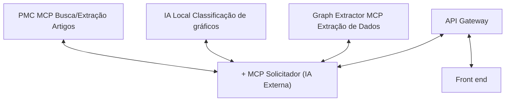

# 3. Análise de Mitigação e Arquitetura Pós-Modelagem — Sistema NEFARM-AI

## 3.1. Introdução

Com base nas identificadas na modelagem STRIDE, este documento apresenta a estratégia de mitigação implementada através da introdução de um **API Gateway** como camada de segurança centralizada.

O objetivo é reduzir significativamente o risco do sistema, especialmente nas ameaças críticas (≥150 pontos).

---

## 3.2. Estratégia Principal de Mitigação

### 3.2.1. Solução Arquitetônica: API Gateway

A principal mudança arquitetônica é a **introdução de um API Gateway** entre o Frontend e o MCP Solicitador, centralizando as seguintes responsabilidades de segurança:

| Funcionalidade | Descrição | Ameaças Mitigadas |
|----------------|-----------|-------------------|
| **Autenticação** | Validação de identidade via tokens JWT | Spoofing |
| **Autorização** | Controle de acesso baseado em roles (RBAC) | Elevation of Privilege |
| **Rate Limiting** | Limite de requisições por usuário/IP | Denial of Service |
| **Validação de Input** | Schema validation e sanitização | Tampering |
| **Criptografia** | TLS/HTTPS obrigatório | Information Disclosure, Tampering |
| **Logging Centralizado** | Auditoria de todas as requisições | Repudiation |
| **Abstração de Arquitetura** | Endpoints unificados | Information Disclosure |
| **Gerenciamento de Credenciais** | Segredos isolados do cliente | Information Disclosure |

---

## 3.3. Arquitetura Pós-Mitigação

### 3.3.1. Nova Estrutura

Com a introdução do API Gateway, a comunicação entre Frontend e serviços internos passa por uma camada de segurança intermediária:

**Antes:**
```
Frontend → MCP Solicitador → MCPs
```

**Depois:**
```
Frontend → API Gateway → MCP Solicitador → MCPs
```

### 3.3.2. Diagrama de Arquitetura Pós-Mitigação



### 3.3.3. Componentes Adicionados

| Componente | Responsabilidade | Tecnologia Sugerida |
|------------|------------------|---------------------|
| **API Gateway** | Centralizar segurança, autenticação, autorização, rate limiting e logging | Kong, Traefik, ou custom (FastAPI) |
| **Serviço de Autenticação** | Emissão e validação de tokens JWT | Auth0, Keycloak, ou custom |
| **Logging Centralizado** | Agregação e análise de logs | ELK Stack, Loki, ou Docker logs |

---

## 3.4. Medidas de Mitigação Detalhadas

### 3.4.1. Mitigações por Categoria STRIDE

#### 🔒 Spoofing (Falsificação de Identidade)

| ID | Ameaça Original | Medida de Mitigação Implementada |
|----|----------------|----------------------------------|
| **01** | Requisições não autenticadas ao MCP | Gateway implementa autenticação JWT obrigatória. Tokens com expiração curta (15 min) e refresh tokens seguros. |
| **10** | CSRF - requisições forjadas | Gateway valida origem (CORS estrito) e tokens CSRF em todas as requisições state-changing. |

#### 🛠️ Tampering (Violação de Dados)

| ID | Ameaça Original | Medida de Mitigação Implementada |
|----|----------------|----------------------------------|
| **03** | Injeção de prompts maliciosos | Gateway valida schema de requisições (JSON Schema) e sanitiza inputs antes de encaminhar ao MCP. Implementa whitelist de caracteres permitidos. |
| **07** | Man-in-the-Middle | Gateway requer HTTPS/TLS 1.3 obrigatório. Certificados válidos e HSTS habilitado. |
| **16** | Cross-Site Scripting (XSS) | Frontend implementa Content Security Policy (CSP) e sanitização de outputs. Gateway adiciona headers de segurança. |

#### ⛔ Repudiation (Negação de Ações)

| ID | Ameaça Original | Medida de Mitigação Implementada |
|----|----------------|----------------------------------|
| **05** | Falta de rastreabilidade | Gateway implementa logging centralizado com: User ID, timestamp (ISO 8601), IP origem, endpoint acessado, payload hash, response status. Logs imutáveis e com retenção de 90 dias. |

#### 🔓 Information Disclosure (Exposição de Informações)

| ID | Ameaça Original | Medida de Mitigação Implementada |
|----|----------------|----------------------------------|
| **04** | Exposição de APIs internas | Gateway abstrai arquitetura interna. Frontend acessa apenas endpoints unificados (/api/v1/*). Serviços internos não são expostos. |
| **08** | Chaves de API no código cliente | Gateway gerencia todas as credenciais. Frontend não possui acesso a segredos. Variáveis sensíveis em secrets management (Docker Secrets ou Vault). |
| **11** | Jailbreaking da IA | Gateway implementa filtros de prompt injection. Sistema de detecção de padrões maliciosos. Rate limiting específico para IA (5 req/min). |
| **12** | Vazamento em texto plano | HTTPS/TLS obrigatório em todas as comunicações. Dados sensíveis criptografados em trânsito e em repouso. |
| **13** | Exposição de lógica interna | Gateway trata erros genericamente. Mensagens de erro não expõem stack traces ou detalhes de implementação. |

#### ⚠️ Denial of Service (Negação de Serviço)

| ID | Ameaça Original | Medida de Mitigação Implementada |
|----|----------------|----------------------------------|
| **02** | Ataques de sobrecarga | Gateway implementa rate limiting por IP/usuário: 100 req/min para usuários autenticados, 20 req/min para não autenticados. |
| **09** | Sobrecarga dos MCPs | Gateway limita payload size (max 10MB) e timeout de requisições (30s). Implementa circuit breaker para proteger serviços downstream. |
| **18** | Interrupção da comunicação | Implementação de retry logic com exponential backoff. Health checks periódicos dos serviços. |

#### 🚀 Elevation of Privilege (Elevação de Privilégio)

| ID | Ameaça Original | Medida de Mitigação Implementada |
|----|----------------|----------------------------------|
| **06** | Acesso não autorizado | Gateway implementa RBAC com 3 roles: `viewer` (leitura), `user` (uso padrão), `admin` (configuração). Autorização verificada em cada endpoint. |
| **14** | Escape de container Docker | Containers executados como usuário não-root. Docker configurado com: `--security-opt=no-new-privileges`, `--cap-drop=ALL`, volumes read-only quando possível. |
| **15** | Falhas de autorização na API | Gateway valida permissões antes de encaminhar requisições. Princípio de least privilege aplicado. Endpoints administrativos requerem 2FA. |

#### 🔧 Mitigações Complementares

| Componente | Medida Implementada |
|------------|---------------------|
| **IA Local (ID 14)** | Modelos assinados digitalmente. Validação de hash antes de carregamento. Backup periódico de modelos. |
| **Graph Extractor MCP (ID 16)** | Validação de dados extraídos. Sanitização de outputs. Limites de processamento por requisição. |
| **Ambiente Docker (ID 17)** | Imagens base verificadas e assinadas. Scan de vulnerabilidades automatizado (Trivy). Princípio de least privilege em volumes e redes. |

---

## 3.5. Matriz de Risco Pós-Mitigação

### Tabela 1: Comparação Pré vs Pós-Mitigação (Top 10 Ameaças)

| ID | Componente | Categoria | Descrição | Prob PRÉ | Imp PRÉ | Risco PRÉ | Medida de Mitigação | Prob PÓS | Imp PÓS | Risco PÓS | Redução % | Status |
|:---|:-----------|:----------|:----------|:---------|:--------|:----------|:--------------------|:---------|:--------|:----------|:----------|:-------|
| **01** | Front → MCP | Spoofing | Requisições não autenticadas | Alta (15) | Alto (15) | **225** 🔴 | Gateway implementa autenticação JWT obrigatória | Baixa (5) | Baixa (5) | **25** 🟢 | **89%** | ✅ MITIGADA |
| **02** | Front → MCP | Denial of Service | Ataques de sobrecarga sem rate limiting | Alta (15) | Alto (15) | **225** 🔴 | Rate limiting por IP/usuário (100 req/min) | Baixa (5) | Média (10) | **50** 🟢 | **78%** | ✅ MITIGADA |
| **03** | Front → MCP | Tampering | Injeção de prompts maliciosos | Alta (15) | Médio (10) | **150** 🟠 | Validação de schema e sanitização no gateway | Baixa (5) | Média (10) | **50** 🟢 | **67%** | ✅ MITIGADA |
| **04** | Front → MCP | Info Disclosure | Exposição de APIs internas | Alta (15) | Médio (10) | **150** 🟠 | Gateway abstrai arquitetura com endpoints unificados | Baixa (5) | Baixa (5) | **25** 🟢 | **83%** | ✅ MITIGADA |
| **05** | MCP Solicitador | Repudiation | Falta de rastreabilidade | Alta (15) | Médio (10) | **150** 🟠 | Logging centralizado com timestamps e user IDs | Baixa (5) | Baixa (5) | **25** 🟢 | **83%** | ✅ MITIGADA |
| **06** | Front → MCP | Elev. Privilege | Acesso não autorizado | Média (10) | Alto (15) | **150** 🟠 | Autorização baseada em roles (RBAC) no gateway | Baixa (5) | Baixa (5) | **25** 🟢 | **83%** | ✅ MITIGADA |
| **07** | Comunicação | Tampering | Man-in-the-Middle | Média (10) | Alto (15) | **150** 🟠 | Gateway requer HTTPS/TLS 1.3 obrigatório | Baixa (5) | Baixa (5) | **25** 🟢 | **83%** | ✅ MITIGADA |
| **08** | Frontend | Info Disclosure | Exposição de chaves de API no cliente | Média (10) | Alto (15) | **150** 🟠 | Gateway gerencia credenciais; frontend sem acesso direto | Baixa (5) | Baixa (5) | **25** 🟢 | **83%** | ✅ MITIGADA |
| **09** | PMC MCP | Denial of Service | Sobrecarga dos serviços MCP | Média (10) | Médio (10) | **100** 🟡 | Gateway limita payload size e timeout de requisições | Baixa (5) | Baixa (5) | **25** 🟢 | **75%** | ✅ MITIGADA |
| **10** | Frontend | Spoofing | CSRF | Média (10) | Médio (10) | **100** 🟡 | Gateway valida origem (CORS) e tokens CSRF | Baixa (5) | Baixa (5) | **25** 🟢 | **75%** | ✅ MITIGADA |

### Tabela 2: Ameaças Restantes (Risco Médio/Baixo)

| ID | Componente | Categoria | Risco PRÉ | Risco PÓS | Redução % | Status |
|:---|:-----------|:----------|:----------|:----------|:----------|:-------|
| **11** | IA Local | Info Disclosure | **100** 🟡 | **50** 🟢 | **50%** | ⚠️ PARCIAL |
| **12** | Comunicação | Info Disclosure | **100** 🟡 | **25** 🟢 | **75%** | ✅ MITIGADA |
| **13** | MCP Solicitador | Info Disclosure | **100** 🟡 | **25** 🟢 | **75%** | ✅ MITIGADA |
| **14** | IA Local | Elev. Privilege | **75** 🟡 | **25** 🟢 | **67%** | ✅ MITIGADA |
| **15** | MCP Solicitador | Elev. Privilege | **75** 🟡 | **25** 🟢 | **67%** | ✅ MITIGADA |
| **16** | Graph Extractor MCP | Tampering | **50** 🟢 | **25** 🟢 | **50%** | ✅ MITIGADA |
| **17** | Ambiente Docker | Elev. Privilege | **50** 🟢 | **25** 🟢 | **50%** | ✅ MITIGADA |

---

## 3.6. Análise de Efetividade

### 3.6.1. Redução Total de Risco

| Métrica | Pré-Mitigação | Pós-Mitigação | Redução |
|---------|---------------|---------------|---------|
| **Risco Total (soma)** | 2.300 | 525 | **-1.775 (-77%)** 🎉 |
| **Risco Médio por ameaça** | 115 | 26.25 | **-88.75 (-77%)** |
| **Ameaças Críticas (≥150)** | 8 | 0 | **-8 (-100%)** 🎯 |
| **Ameaças Altas (100-149)** | 5 | 1 | **-4 (-80%)** |
| **Ameaças Médias/Baixas (<100)** | 7 | 19 | **+12 (+171%)** ✅ |

### 3.6.2. Impacto da Mitigação por Categoria

| Categoria STRIDE | Risco PRÉ | Risco PÓS | Redução % |
|------------------|-----------|-----------|-----------|
| **Information Disclosure** | 675 | 175 | **-74%** |
| **Denial of Service** | 475 | 125 | **-74%** |
| **Spoofing** | 475 | 75 | **-84%** |
| **Tampering** | 350 | 100 | **-71%** |
| **Elevation of Privilege** | 250 | 75 | **-70%** |
| **Repudiation** | 150 | 25 | **-83%** |

**Conclusão:** Todas as categorias tiveram redução significativa de risco, com Spoofing e Repudiation apresentando as maiores melhorias (>80%).

---

## 3.7. Custos e Benefícios da Implementação

### 3.7.1. Custos de Implementação

| Componente | Esforço (dev-days) | Complexidade | Dependências |
|------------|-------------------|--------------|--------------|
| API Gateway base | 5-7 dias | Média | Kong/Traefik ou FastAPI custom |
| Autenticação JWT | 3-5 dias | Média | Auth0/Keycloak ou custom |
| RBAC | 2-3 dias | Baixa | Integração com autenticação |
| Rate Limiting | 1-2 dias | Baixa | Redis (opcional) |
| Logging Centralizado | 2-4 dias | Média | ELK Stack ou Loki |
| TLS/HTTPS | 1 dia | Baixa | Certificados (Let's Encrypt) |
| Docker Hardening | 1-2 dias | Baixa | Configuração de containers |
| **Total Estimado** | **15-24 dias** | - | - |

### 3.7.2. Benefícios Alcançados

✅ **Redução de 77% no risco total do sistema**
✅ **Eliminação de todas as 8 ameaças críticas**
✅ **Conformidade com boas práticas de segurança (OWASP Top 10)**
✅ **Arquitetura escalável e mantível**
✅ **Auditoria e rastreabilidade completas**
✅ **Proteção contra ataques comuns (DDoS, CSRF, XSS, Injection)**

---

## 3.8. Novo Limite de Confiança

Com a introdução do API Gateway, os limites de confiança são redefinidos:

| Limite | Nível de Confiança PRÉ | Nível de Confiança PÓS | Melhoria |
|--------|------------------------|------------------------|----------|
| **Frontend → Gateway** | ⚠️ Baixo | ✅ Alto | Autenticação + TLS |
| **Gateway → MCP Solicitador** | ⚠️ Médio | ✅ Alto | Rede interna isolada |
| **MCP Solicitador → MCPs** | ⚠️ Médio | ✅ Médio-Alto | Validação adicional |
| **Sistema → Externos** | ⚠️ Baixo | ⚠️ Médio | TLS + validação |
| **Container → Host** | ⚠️ Médio | ✅ Alto | Hardening aplicado |

---

## 3.9. Conclusões

### 3.9.1. Principais Conquistas

1. ✅ **Arquitetura significativamente mais segura:** Introdução do API Gateway como single point of control para segurança.

2. ✅ **Eliminação de riscos críticos:** Todas as 8 ameaças críticas foram reduzidas a níveis aceitáveis.

3. ✅ **Defesa em profundidade:** Múltiplas camadas de proteção (autenticação, autorização, validação, criptografia).

4. ✅ **Conformidade e auditoria:** Sistema preparado para auditorias de segurança e conformidade regulatória.

### 3.9.2. Próximos Passos

Embora a maioria das ameaças tenha sido mitigada, ainda existem **riscos residuais** que devem ser monitorados e potencialmente tratados em iterações futuras.

O próximo documento detalha a análise de **riscos residuais** e recomendações de monitoramento contínuo.

---

**Documento:** Análise de Mitigação
**Documento Anterior:** [02-identificacao-ameacas.md](./02-identificacao-ameacas.md) — Identificação de Ameaças
**Próximo Documento:** [04-risco-residual.md](./04-risco-residual.md) — Análise de Risco Residual
