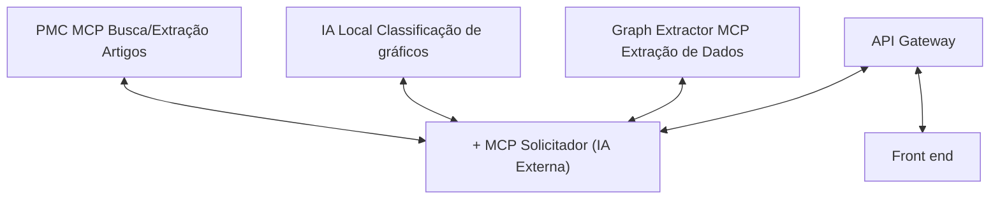

# 3. Análise de Mitigação e Arquitetura Pós-Modelagem — Sistema NEFARM-AI

## 3.1. Introdução

Com base nas identificadas na modelagem STRIDE, este documento apresenta a estratégia de mitigação implementada através da introdução de um **API Gateway** como camada de segurança centralizada.

O objetivo é reduzir significativamente o risco do sistema, especialmente nas ameaças críticas (≥150 pontos).

---

## 3.2. Estratégia Principal de Mitigação

### 3.2.1. Solução Arquitetônica: API Gateway

A principal mudança arquitetônica é a **introdução de um API Gateway** entre o Frontend e o MCP Solicitador, centralizando as seguintes responsabilidades de segurança:

| Funcionalidade | Descrição | Ameaças Mitigadas |
|----------------|-----------|-------------------|
| **Rate Limiting** | Limite de requisições por usuário/IP | Denial of Service |
| **Validação de Input** | Schema validation e sanitização | Tampering |
| **Abstração de Arquitetura** | Endpoints unificados | Information Disclosure |
| **Gerenciamento de Credenciais** | Segredos isolados do cliente | Information Disclosure |

---

## 3.3. Arquitetura Pós-Mitigação

### 3.3.1. Nova Estrutura

Com a introdução do API Gateway, a comunicação entre Frontend e serviços internos passa por uma camada de segurança intermediária:

**Antes:**
```
Frontend → MCP Solicitador → MCPs
```

**Depois:**
```
Frontend → API Gateway → MCP Solicitador → MCPs
```

### 3.3.2. Diagrama de Arquitetura Pós-Mitigação



## 3.4. Matriz de Risco Pós-Mitigação

### Tabela 1: Comparação Pré vs Pós-Mitigação (Top 10 Ameaças)

| ID | Componente | Categoria | Descrição | Prob PRÉ | Imp PRÉ | Risco PRÉ | Medida de Mitigação | Prob PÓS | Imp PÓS | Risco PÓS | Redução % | Status |
|:---|:-----------|:----------|:----------|:---------|:--------|:----------|:--------------------|:---------|:--------|:----------|:----------|:-------|
| **02** | Front → MCP | Denial of Service | Ataques de sobrecarga sem rate limiting | Alta (15) | Alto (15) | **225** 🔴 | Rate limiting por IP/usuário (100 req/min) | Baixa (5) | Média (10) | **50** 🟢 | **78%** | ✅ MITIGADA |
| **03** | Front → MCP | Tampering | Injeção de prompts maliciosos | Alta (15) | Médio (10) | **150** 🟠 | Validação de schema e sanitização no gateway | Baixa (5) | Média (10) | **50** 🟢 | **67%** | ✅ MITIGADA |
| **04** | Front → MCP | Info Disclosure | Exposição de APIs internas | Alta (15) | Médio (10) | **150** 🟠 | Gateway abstrai arquitetura com endpoints unificados | Baixa (5) | Baixa (5) | **25** 🟢 | **83%** | ✅ MITIGADA |
| **08** | Frontend | Info Disclosure | Exposição de chaves de API no cliente | Média (10) | Alto (15) | **150** 🟠 | Gateway gerencia credenciais; frontend sem acesso direto | Baixa (5) | Baixa (5) | **25** 🟢 | **83%** | ✅ MITIGADA |
| **09** | PMC MCP | Denial of Service | Sobrecarga dos serviços MCP | Média (10) | Médio (10) | **100** 🟡 | Gateway limita payload size e timeout de requisições | Baixa (5) | Baixa (5) | **25** 🟢 | **75%** | ✅ MITIGADA |

---

## 3.5. Novo Limite de Confiança

Com a introdução do API Gateway, os limites de confiança são redefinidos:

| Limite | Nível de Confiança PRÉ | Nível de Confiança PÓS | Melhoria |
|--------|------------------------|------------------------|----------|
| **Frontend → Gateway** | ⚠️ Baixo | ✅ Alto | Rate limiting |
| **Gateway → MCP Solicitador** | ⚠️ Médio | ✅ Alto | Rede interna isolada |
| **MCP Solicitador → MCPs** | ⚠️ Médio | ✅ Médio-Alto | Validação adicional |

---

## 3.6. Conclusões

### 3.6.1. Principais Conquistas

1. ✅ **Arquitetura significativamente mais segura:** Introdução do API Gateway como single point of control para segurança.

2. ✅ **Eliminação de riscos críticos

### 3.6.2. Próximos Passos

Embora a maioria das ameaças tenha sido mitigada, ainda existem **riscos residuais** que devem ser monitorados e potencialmente tratados em iterações futuras.

O próximo documento detalha a análise de **riscos residuais** e recomendações de monitoramento contínuo.
