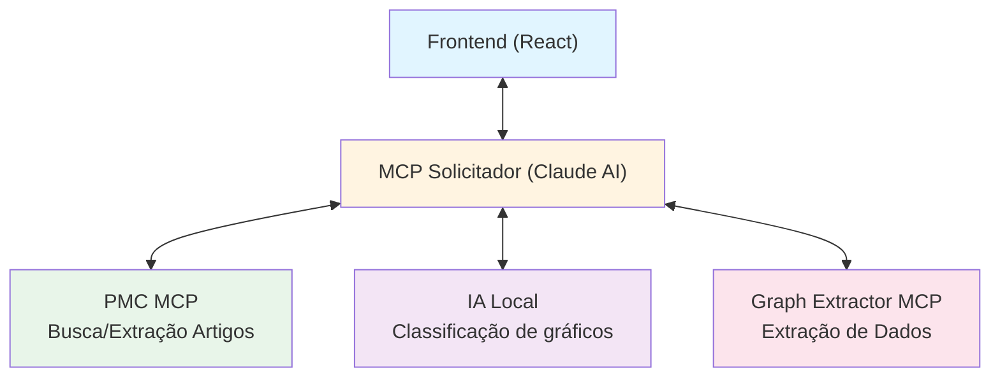

# ENTREGA 1: Visão Arquitetônica Inicial (Pré-Modelagem de Ameaças)

**Pontuação:** 5 pontos
**Data:** 2025-11-25
**Sistema:** NEFARM-AI

---

## 📋 Sumário Executivo

Este documento apresenta a **visão arquitetônica inicial** do sistema NEFARM-AI, antes da aplicação da modelagem de ameaças. O objetivo é documentar a estrutura do sistema, seus componentes, fluxos de dados e superfície de ataque inicial para servir como base para a análise de segurança.

---

## 1. Introdução ao Sistema

### 1.1. Propósito

O **NEFARM-AI** é um sistema voltado à extração e análise automatizada de informações visuais presentes em artigos científicos, com foco em:

- Buscar artigos científicos em repositórios (PubMed Central)
- Identificar e classificar gráficos científicos
- Extrair dados numéricos de gráficos
- Apresentar resultados de forma organizada ao usuário

### 1.2. Contexto de Uso

- **Público-alvo:** Pesquisadores e acadêmicos
- **Ambiente:** Sistema web para uso acadêmico
- **Escopo:** Análise de artigos científicos de acesso aberto

---

## 2. Arquitetura Inicial do Sistema

### 2.1. Visão Geral

O sistema segue uma **arquitetura orientada a serviços** (SOA), composta por módulos independentes que se comunicam de forma orquestrada através de um MCP (Model Context Protocol) Solicitador.

**Características principais:**
- Frontend React comunicando diretamente com backend MCP
- Múltiplos serviços MCP especializados
- Ambiente containerizado com Docker
- Sem camada de segurança centralizada (Gateway)

### 2.2. Componentes do Sistema

| Componente | Descrição | Tecnologia | Responsabilidade |
|------------|-----------|------------|------------------|
| **Frontend** | Interface web para interação com usuários | React, Next.js | - Apresentação de interface<br>- Captura de requisições do usuário<br>- Exibição de resultados |
| **MCP Solicitador** | Orquestrador central de serviços MCP | Claude AI (Anthropic) | - Receber requisições do frontend<br>- Coordenar chamadas aos MCPs especializados<br>- Consolidar respostas |
| **PMC MCP** | Serviço de busca em PubMed Central | Python, MCP SDK | - Buscar artigos científicos<br>- Extrair metadados e figuras<br>- Download de imagens |
| **IA Local** | Classificador de gráficos | Python, Ollama (llama3:8b) | - Classificar imagens como gráfico/não-gráfico<br>- Fornecer nível de confiança |
| **Graph Extractor MCP** | Extrator de dados de gráficos | Python, MCP SDK | - Extrair dados numéricos de gráficos<br>- Processar imagens de gráficos |
| **Ambiente Docker** | Plataforma de containerização | Docker Compose | - Isolamento de serviços<br>- Gerenciamento de containers |

### 2.3. Diagrama de Arquitetura Inicial



---

## 3. Fluxo de Dados

### 3.1. Fluxo Principal de Operação

**Cenário típico:** Usuário busca artigos sobre "diabetes treatment"

```
┌─────────────────────────────────────────────────────────────┐
│  1. USUÁRIO → FRONTEND                                      │
│     "Buscar artigos sobre diabetes treatment"               │
└─────────────────────────────────────────────────────────────┘
                            ↓
┌─────────────────────────────────────────────────────────────┐
│  2. FRONTEND → MCP SOLICITADOR                              │
│     POST /api/query                                         │
│     { "query": "diabetes treatment" }                       │
└─────────────────────────────────────────────────────────────┘
                            ↓
┌─────────────────────────────────────────────────────────────┐
│  3. MCP SOLICITADOR → PMC MCP                               │
│     Executa: search_articles("diabetes treatment")          │
│     Retorna: Lista de artigos com PMCIDs                    │
└─────────────────────────────────────────────────────────────┘
                            ↓
┌─────────────────────────────────────────────────────────────┐
│  4. MCP SOLICITADOR → PMC MCP                               │
│     Executa: extract_figures(pmcid)                         │
│     Retorna: Metadados de figuras + URLs de imagens        │
└─────────────────────────────────────────────────────────────┘
                            ↓
┌─────────────────────────────────────────────────────────────┐
│  5. MCP SOLICITADOR → IA LOCAL                              │
│     Executa: classify_image(description)                    │
│     Retorna: {classificacao: "GRAFICO", confianca: 0.9}     │
└─────────────────────────────────────────────────────────────┘
                            ↓
┌─────────────────────────────────────────────────────────────┐
│  6. MCP SOLICITADOR → GRAPH EXTRACTOR                       │
│     Executa: extract_graph_data(image_path)                 │
│     Retorna: [{x: 1, y: 2}, {x: 2, y: 4}, ...]              │
└─────────────────────────────────────────────────────────────┘
                            ↓
┌─────────────────────────────────────────────────────────────┐
│  7. MCP SOLICITADOR → FRONTEND                              │
│     Retorna: Artigos + Gráficos + Dados extraídos          │
└─────────────────────────────────────────────────────────────┘
                            ↓
┌─────────────────────────────────────────────────────────────┐
│  8. FRONTEND → USUÁRIO                                      │
│     Exibe: Interface com artigos e gráficos interativos     │
└─────────────────────────────────────────────────────────────┘
```

### 3.2. Elementos do DFD (Data Flow Diagram)

**Entidades Externas:**
- 👤 Usuário final (pesquisador)
- 🌐 PubMed Central API
- 🤖 Ollama (modelo de IA local)

**Processos:**
1. Frontend (interface React)
2. MCP Solicitador (orquestração)
3. PMC MCP (busca de artigos)
4. IA Local (classificação)
5. Graph Extractor MCP (extração de dados)

**Armazenamentos de Dados:**
- 💾 Imagens baixadas localmente (pasta `imagens/`)
- 💾 Modelos de IA (Ollama)

**Fluxos de Dados:**
- Frontend ↔ MCP Solicitador (HTTP/JSON)
- MCP Solicitador ↔ MCPs especializados (MCP Protocol)
- MCPs ↔ APIs externas (HTTPS/REST)

---

## 4. Limites de Confiança

### 4.1. Identificação de Limites

Os **limites de confiança** representam fronteiras onde o controle de segurança muda ou onde dados transitam entre diferentes zonas de confiança.

| Limite | Descrição | Nível de Confiança Inicial | Justificativa |
|--------|-----------|---------------------------|---------------|
| **🔴 Frontend → MCP Solicitador** | Comunicação entre navegador do usuário e backend | ⚠️ **BAIXO** | - Sem autenticação<br>- Sem validação de entrada<br>- Comunicação direta exposta |
| **🟡 MCP Solicitador → MCPs** | Comunicação interna entre serviços backend | ⚠️ **MÉDIO** | - Comunicação interna<br>- Sem isolamento de rede<br>- Possível interceptação |
| **🟡 MCPs → APIs Externas** | Chamadas a serviços de terceiros (PMC, Ollama) | ⚠️ **MÉDIO** | - Dependência de serviços externos<br>- Confiança em terceiros |
| **🟢 Container → Host** | Isolamento de containers Docker | ⚠️ **MÉDIO-ALTO** | - Docker fornece isolamento<br>- Configurações padrão podem ser inseguras |

### 4.2. Diagrama de Limites de Confiança

```
┌─────────────────────────────────────────────────────────────┐
│                    ZONA NÃO CONFIÁVEL                       │
│                                                             │
│  ┌──────────────────────────────────────┐                  │
│  │  Navegador do Usuário (Frontend)     │                  │
│  └──────────────────────────────────────┘                  │
│                       ↕ ⚠️ LIMITE CRÍTICO                   │
└─────────────────────────────────────────────────────────────┘
                        ↕ (HTTP sem segurança)
┌─────────────────────────────────────────────────────────────┐
│              ZONA SEMI-CONFIÁVEL (Backend)                  │
│                                                             │
│  ┌──────────────────────────────────────┐                  │
│  │     MCP Solicitador (Orquestrador)   │                  │
│  └──────────────────────────────────────┘                  │
│            ↕           ↕           ↕                        │
│  ┌─────────┐   ┌──────────┐   ┌──────────┐                │
│  │ PMC MCP │   │ IA Local │   │Graph Ext │                │
│  └─────────┘   └──────────┘   └──────────┘                │
│                                                             │
└─────────────────────────────────────────────────────────────┘
                        ↕
┌─────────────────────────────────────────────────────────────┐
│              ZONA EXTERNA (Internet)                        │
│                                                             │
│     PubMed Central     │     Ollama Local                  │
└─────────────────────────────────────────────────────────────┘
```

---

## 5. Superfície de Ataque Inicial

### 5.1. Definição

A **superfície de ataque** é o conjunto de todos os pontos onde um atacante não autorizado pode tentar entrar ou extrair dados do sistema.

### 5.2. Pontos de Exposição Identificados

#### 🎯 1. Interface Web (Frontend)

**Exposição:**
- Endpoints HTTP públicos
- Código JavaScript executado no navegador
- Formulários de entrada do usuário

**Vetores de Ataque Potenciais:**
- Cross-Site Scripting (XSS)
- Cross-Site Request Forgery (CSRF)
- Manipulação de requisições HTTP
- Exposição de credenciais no código cliente

#### 🎯 2. API do MCP Solicitador

**Exposição:**
- Endpoint principal de comunicação
- Recebe requisições diretas do frontend
- Orquestra múltiplos serviços

**Vetores de Ataque Potenciais:**
- Requisições não autenticadas
- Injeção de prompts maliciosos
- Ataques de negação de serviço (DoS)
- Enumeração de endpoints internos

#### 🎯 3. Comunicação Entre Serviços

**Exposição:**
- Tráfego entre MCP Solicitador e MCPs
- Dados em trânsito sem criptografia
- Rede Docker compartilhada

**Vetores de Ataque Potenciais:**
- Interceptação Man-in-the-Middle (MITM)
- Sniffing de tráfego de rede
- Adulteração de mensagens

#### 🎯 4. Serviços MCP Individuais

**Exposição:**
- PMC MCP: comunicação com API externa
- IA Local: processamento de prompts
- Graph Extractor: processamento de imagens

**Vetores de Ataque Potenciais:**
- Prompt injection na IA
- Sobrecarga de recursos (DoS)
- Execução de código malicioso via imagens

#### 🎯 5. Ambiente de Containers

**Exposição:**
- Configurações Docker
- Volumes compartilhados
- Rede de containers

**Vetores de Ataque Potenciais:**
- Container escape
- Acesso ao host através de vulnerabilidades
- Exposição de variáveis de ambiente

### 5.3. Mapa da Superfície de Ataque

```
SUPERFÍCIE DE ATAQUE INICIAL
═══════════════════════════════════════════════════════════

1️⃣  CAMADA DE APRESENTAÇÃO
    ├─ 🌐 Frontend React (porta 3000)
    │   ├─ Formulários de entrada ⚠️
    │   ├─ Código JavaScript ⚠️
    │   └─ Local Storage ⚠️
    │
2️⃣  CAMADA DE ORQUESTRAÇÃO
    ├─ 🤖 MCP Solicitador (Claude AI)
    │   ├─ API endpoints expostos ⚠️⚠️
    │   ├─ Processamento de prompts ⚠️⚠️
    │   └─ Sem autenticação ⚠️⚠️⚠️
    │
3️⃣  CAMADA DE SERVIÇOS
    ├─ 📚 PMC MCP
    │   ├─ Chamadas a APIs externas ⚠️
    │   └─ Download de arquivos ⚠️
    ├─ 🧠 IA Local (Ollama)
    │   ├─ Processamento de descrições ⚠️
    │   └─ Modelo local ⚠️
    └─ 📊 Graph Extractor
        ├─ Processamento de imagens ⚠️⚠️
        └─ Extração de dados ⚠️
    │
4️⃣  CAMADA DE INFRAESTRUTURA
    └─ 🐳 Docker Containers
        ├─ Configurações de container ⚠️
        ├─ Volumes compartilhados ⚠️
        └─ Rede interna ⚠️

Legenda: ⚠️ = Risco Baixo | ⚠️⚠️ = Risco Médio | ⚠️⚠️⚠️ = Risco Alto
```

---

## 6. Considerações Iniciais de Segurança

### 6.1. Observações Críticas

Antes de qualquer análise formal de ameaças, já podemos identificar algumas preocupações imediatas:

| # | Preocupação | Componente Afetado | Severidade Estimada |
|---|-------------|-------------------|---------------------|
| 1 | **Ausência de autenticação** | Frontend → MCP Solicitador | 🔴 Alta |
| 2 | **Falta de validação de entrada** | Todos os endpoints | 🔴 Alta |
| 3 | **Comunicação não criptografada** | Comunicação interna | 🟡 Média |
| 4 | **Exposição de arquitetura interna** | Frontend tem conhecimento direto dos MCPs | 🟡 Média |
| 5 | **Ausência de rate limiting** | MCP Solicitador | 🔴 Alta |
| 6 | **Falta de logging centralizado** | Todo o sistema | 🟡 Média |
| 7 | **Credenciais potencialmente expostas** | Frontend | 🔴 Alta |

### 6.2. Próximos Passos

Com base nesta visão inicial, o próximo passo é realizar a **modelagem formal de ameaças** utilizando a metodologia **STRIDE** para:

1. ✅ Identificar ameaças específicas para cada componente
2. ✅ Avaliar probabilidade e impacto de cada ameaça
3. ✅ Calcular níveis de risco
4. ✅ Propor medidas de mitigação
5. ✅ Redesenhar a arquitetura com controles de segurança

---

## 7. Resumo da Entrega

### 7.1. Entregas Realizadas

✅ **Documentação completa da arquitetura inicial**
- Componentes identificados e descritos
- Diagrama arquitetural criado
- Fluxo de dados mapeado

✅ **Análise de limites de confiança**
- 4 limites principais identificados
- Níveis de confiança avaliados
- Zonas de confiança delimitadas

✅ **Mapeamento da superfície de ataque**
- 5 camadas de exposição identificadas
- Vetores de ataque potenciais listados
- Pontos críticos destacados

✅ **Considerações iniciais de segurança**
- 7 preocupações críticas identificadas
- Base para modelagem de ameaças estabelecida

### 7.2. Documentos de Referência

Este documento utiliza os seguintes arquivos de suporte:

- 📊 `arquitetura-pre-mitigacao.mmd` - Diagrama Mermaid da arquitetura
- 🖼️ `pre-modelagem.svg` - Visualização gráfica da arquitetura

---

## 📚 Referências

1. **NIST Special Publication 800-30** - Guide for Conducting Risk Assessments
2. **Microsoft Threat Modeling Tool** - Threat Modeling Methodology
3. **OWASP Application Security Verification Standard (ASVS)**
4. **Docker Security Best Practices** - Container Hardening Guide

---

**Documento:** ENTREGA 1 - Visão Inicial (Pré-Modelagem)
**Próxima Entrega:** [ENTREGA 2 - Modelagem de Ameaças](./ENTREGA-02-modelagem-ameacas.md)
**Pontuação:** 5/15 pontos

---

**Versão:** 1.0
**Data:** 2025-11-25
**Status:** ✅ Completo
